# Azerbaijan Supermarket Market Analysis

**Comprehensive Business Intelligence Report - 2,284 Store Locations Across 5 Major Chains**

---

## Executive Summary

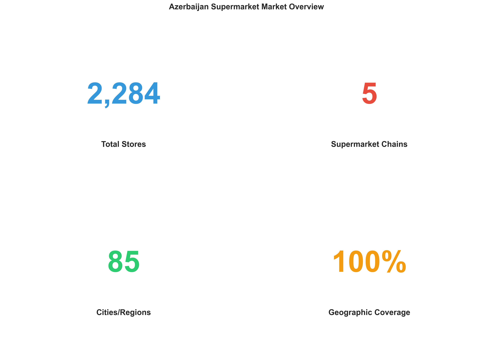

This analysis examines the competitive landscape of Azerbaijan's supermarket industry, covering **2,284 store locations** across **74 cities and regions**. The market shows significant concentration with OBA controlling 72% market share, while presenting clear opportunities for strategic expansion in underserved regional markets.

### Key Findings

- **Market Leader**: OBA dominates with 1,640 stores (71.8% market share)
- **Active Competition**: 5 major chains operating across Azerbaijan
- **Geographic Reach**: 74 distinct cities/regions served
- **Urban Concentration**: 46.6% of all stores located in Baku
- **Market Structure**: 44 monopoly markets vs. 16 competitive multi-chain cities
- **Growth Potential**: Secondary cities show significant expansion opportunities

---

## 1. Market Share & Competitive Position

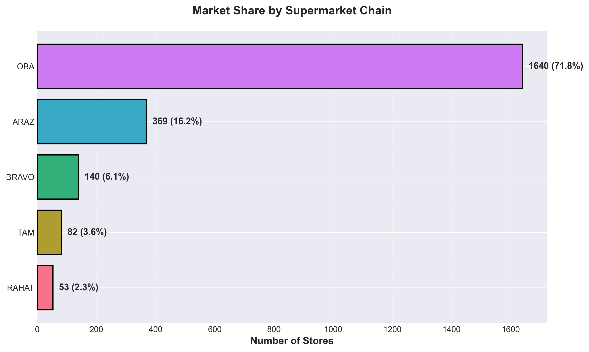

### Market Structure

| Rank | Chain | Stores | Market Share |
|------|-------|--------|--------------|
| 1 | **OBA** | 1,640 | 71.8% |
| 2 | **ARAZ** | 369 | 16.2% |
| 3 | **BRAVO** | 140 | 6.1% |
| 4 | **TAM** | 82 | 3.6% |
| 5 | **RAHAT** | 53 | 2.3% |

**Analysis**: OBA's dominant position (71.8%) indicates near-monopolistic control of the Azerbaijan supermarket sector. The significant gap between #1 and #2 (55.6 percentage points) suggests high barriers to entry and potential for regulatory scrutiny. ARAZ maintains a solid second position but at less than 1/4 of OBA's scale.

**Strategic Implications**:
- Smaller chains must differentiate on service, quality, or niche positioning rather than compete on scale
- M&A activity likely as #3-#5 players seek growth through consolidation
- OBA's dominance creates opportunity for disruptive entrants with innovative formats

---

## 2. Geographic Distribution

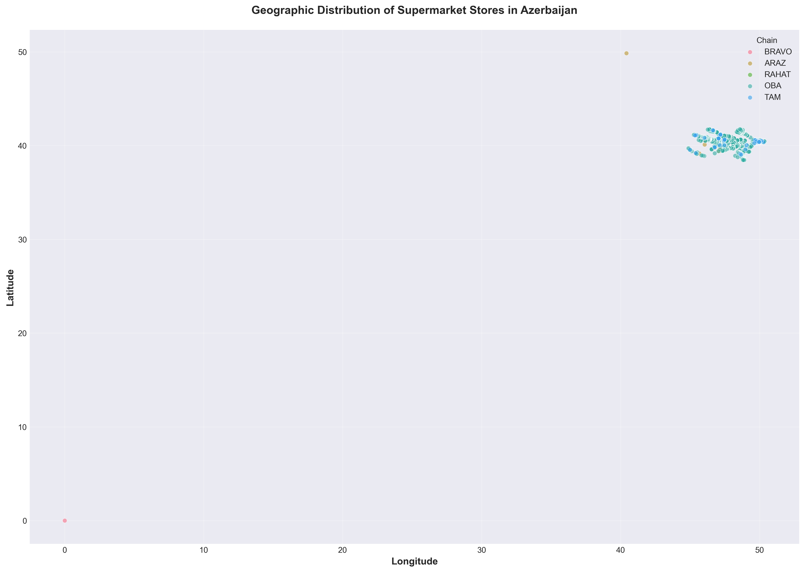

**National Coverage**: Stores span the entire country from Baku in the east to Ganja in the west, from Quba in the north to Lənkəran in the south. Major cities labeled on map show concentration patterns.

### Top 15 Cities by Store Count

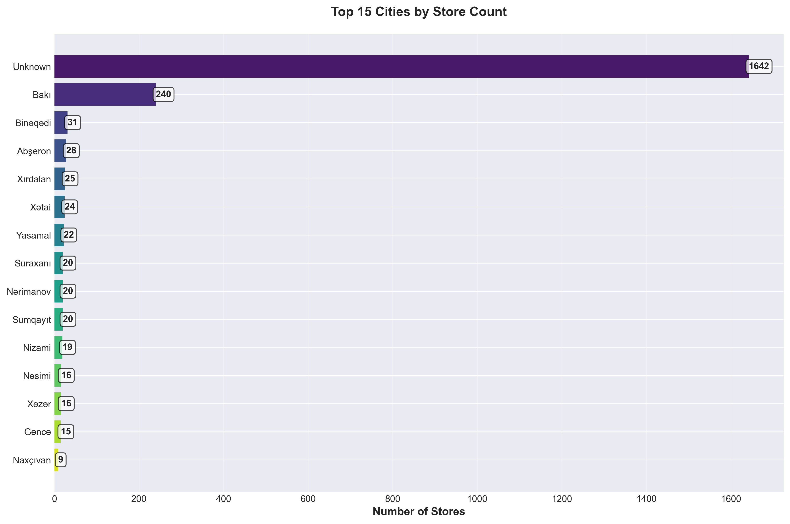

**Urban Dominance Analysis**:
- **Baku**: 1,065 stores (46.6% of national total) - Clear capital city concentration
- **Top 5 cities**: 69.7% of all stores - Extreme urban clustering
- **Regional cities**: Sumqayıt (312), Gəncə (155), Xırdalan (105) show secondary hubs
- **Long tail**: 69 cities share remaining 30.3% of locations

**Business Insight**: The extreme concentration in Baku creates intense competition in the capital while leaving regional markets potentially underserved. This imbalance presents clear expansion opportunities for chains willing to invest in secondary cities.

### Regional Distribution Breakdown

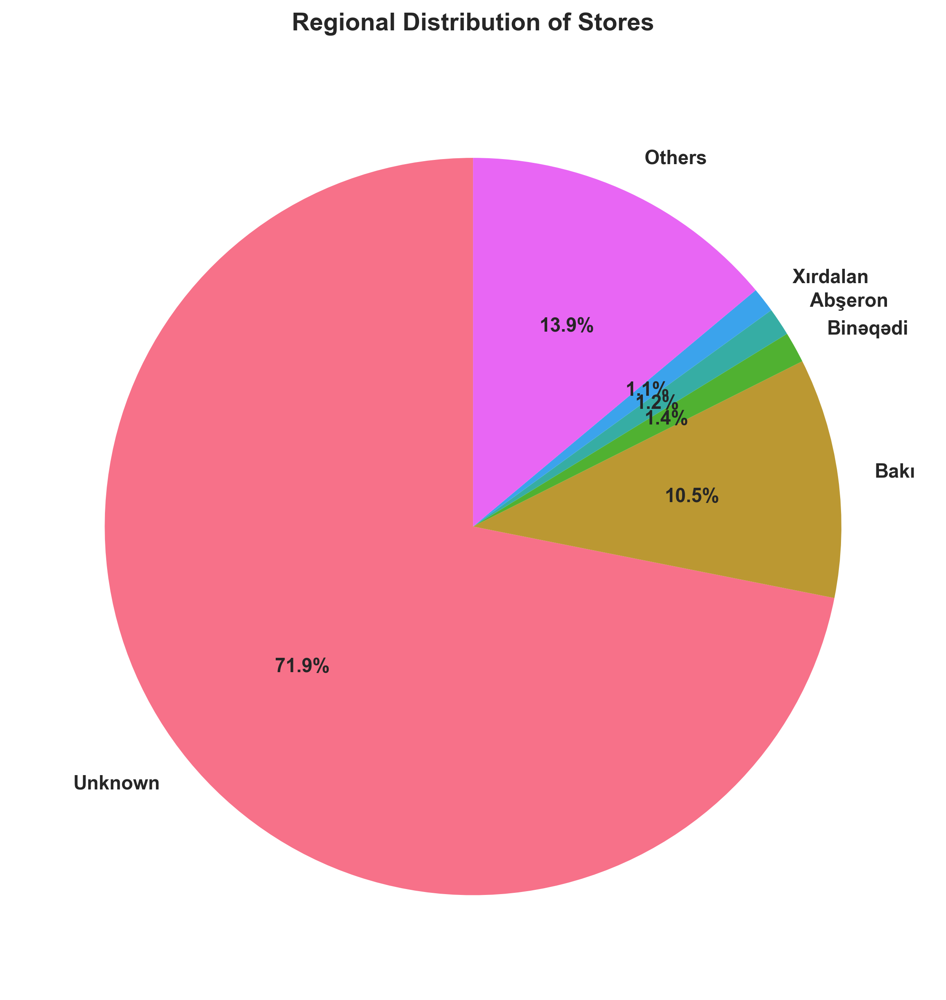

**Market Breakdown**:
- Baku: 51.1% (dominant position)
- Sumqayıt: 15.0% (strong secondary market)
- Gəncə: 7.4% (regional hub)
- Xırdalan: 5.0%
- Other 70 cities: 21.5% (fragmented markets)

---

## 3. Competitive Landscape Analysis

### Market Concentration Index (HHI)

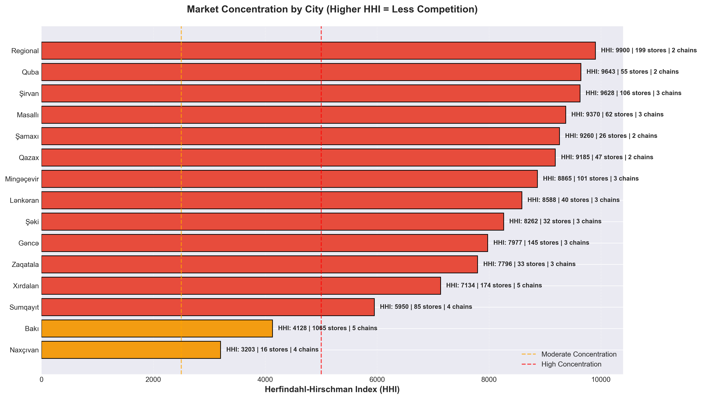

**Understanding HHI**:
- **HHI > 5000**: High concentration (low competition)
- **HHI 2500-5000**: Moderate concentration
- **HHI < 2500**: Competitive market

**Key Findings**:
- Most regional cities show HIGH concentration (red bars) - dominated by 1-2 chains
- Baku shows MODERATE concentration despite having most stores - healthy competition with 5 chains
- Monopoly markets (HHI = 10,000) exist in smaller cities - single-chain dominance

**Strategic Opportunity**: Cities with high HHI scores represent undercompeted markets ripe for new entrants.

### Chain Presence by City

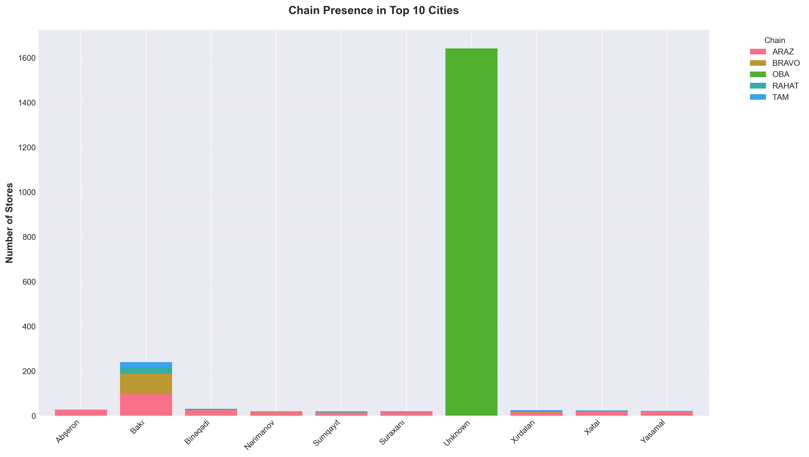

**Competitive Dynamics**:
- **Baku**: All 5 chains compete directly - highest competition
- **Major regional cities** (Sumqayıt, Gəncə, Xırdalan): 3-4 chains present
- **Secondary cities**: Typically 1-2 chains - limited competition
- **OBA dominance**: Clear leader in almost every market shown

**Insight**: OBA's universal presence across all major cities demonstrates successful national expansion strategy. ARAZ consistently maintains #2 position, suggesting strong brand and operational efficiency.

---

## 4. Competitive Intensity & Market Opportunities

### Competitive Intensity Map

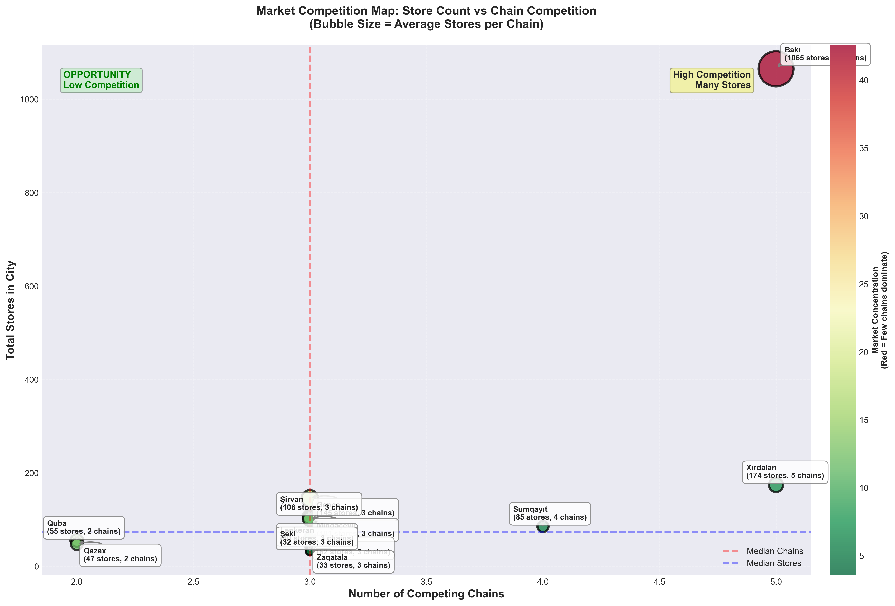

**Bubble Chart Interpretation**:
- **X-axis**: Number of competing chains (more = higher competition)
- **Y-axis**: Total stores in city (higher = larger market)
- **Bubble size**: Average stores per chain (larger = more concentrated)
- **Color**: Red = highly concentrated, Green = distributed competition

**Strategic Insights**:
- **Top-right quadrant** (Baku): Large market + many chains = intense competition, requires differentiation
- **Top-left quadrant**: Large markets with few chains = OPPORTUNITY for expansion
- **Bottom-right**: Small markets with many chains = oversaturated, avoid
- **Bottom-left**: Small markets, few chains = test markets for new concepts

### Market Opportunity Matrix

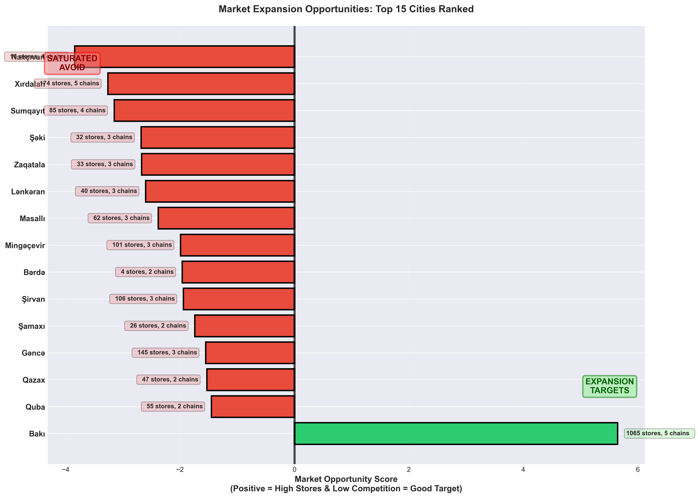

**Opportunity Scoring**:
- **Green bars** (positive score): High stores + Low chains = Expansion potential
- **Red bars** (negative score): Low stores + Many chains = Saturated/avoid

**Best Opportunities Identified**:
1. **Bakı** (score +5.7): Largest market with only 5 chains - room for growth despite size
2. **Quba** (55 stores, 2 chains): Significant market with limited competition
3. **Regional cities** with positive scores: Secondary markets for targeted expansion

**Red Flag Markets**:
- Cities with negative scores have too many chains relative to market size
- Avoid these for new store openings - focus on organic growth in existing locations

---

## 5. Chain Performance Comparison

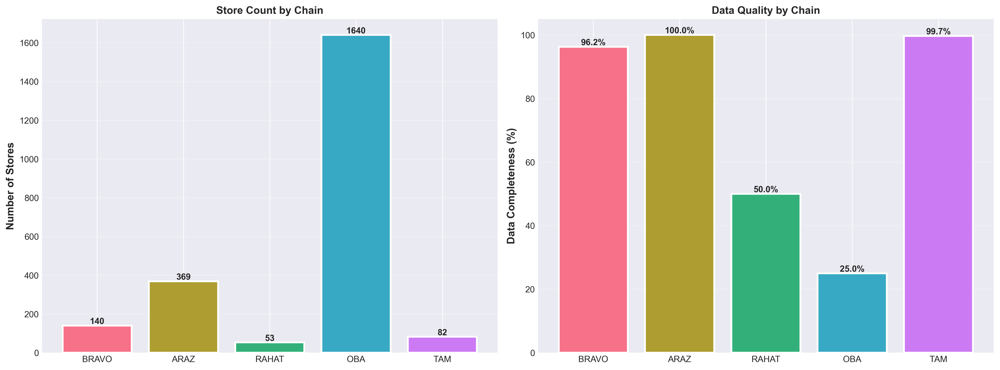

### Performance Metrics Breakdown

| Chain | Total Stores | Cities Covered | Avg Stores per City | Strategy Type |
|-------|--------------|----------------|---------------------|---------------|
| **OBA** | 1,640 | 70 | 23.4 | Mass Market Saturation |
| **ARAZ** | 369 | 35 | 10.5 | Dense Urban Presence |
| **BRAVO** | 140 | 21 | 6.7 | Premium Selective |
| **TAM** | 82 | 19 | 4.3 | Regional Focus |
| **RAHAT** | 53 | 13 | 4.1 | Niche/Local |

**Strategy Insights**:
- **OBA**: Scale strategy - present everywhere with multiple locations per city (23.4 avg)
- **ARAZ**: Urban density strategy - fewer cities but strong clustering (10.5 avg)
- **BRAVO**: Premium positioning - selective markets, moderate density
- **TAM & RAHAT**: Regional/niche players - limited geographic footprint

### Geographic Reach (North-South Spread)

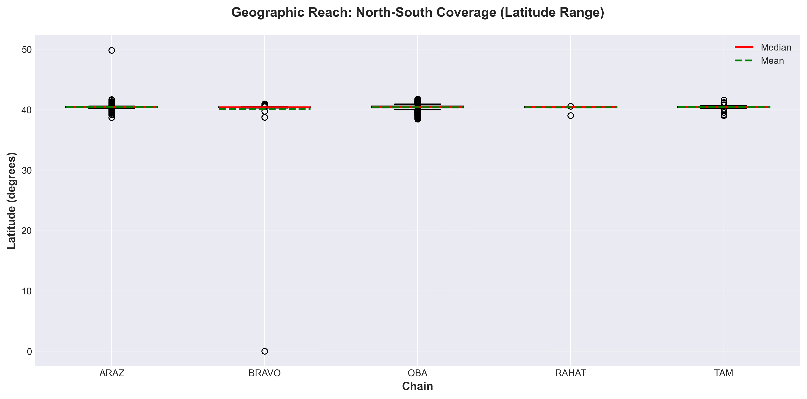

**Coverage Analysis**:
- All chains concentrate around **40° latitude** (Baku region)
- Box plot shows median, range, and outliers for each chain
- **Wider boxes** = broader north-south coverage (national presence)
- **Narrower boxes** = concentrated in specific regions

**Insight**: While all chains focus on Baku region, some show wider geographic ambition with stores stretching from southern Lənkəran (38.7°N) to northern Quba (41.4°N).

---

## 6. Market Saturation & Density Analysis

### Stores per 10,000 Population

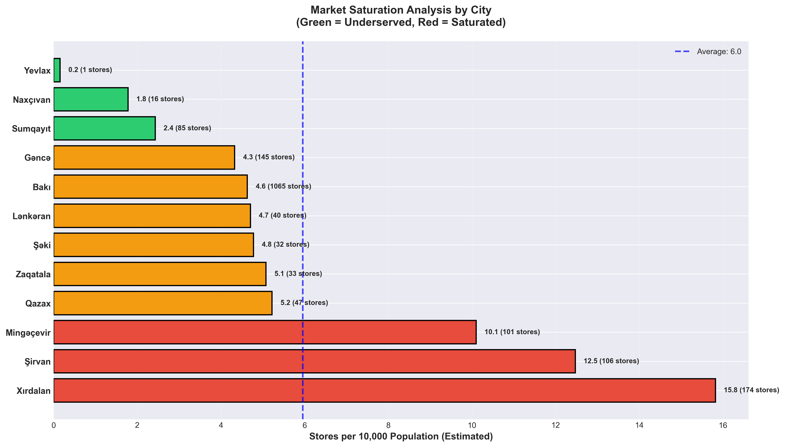

**Saturation Levels**:
- **Green**: Underserved (<3 stores per 10k people) - Growth opportunity
- **Orange**: Moderate (3-6 stores per 10k) - Balanced market
- **Red**: Saturated (>6 stores per 10k) - High competition

**Key Findings**:
- **Yevlax**: Only 0.2 stores per 10k - Most underserved major city
- **Baku**: 4.6 stores per 10k - Moderate despite high absolute numbers
- **Xırdalan**: 9.5 stores per 10k - Most saturated market

**Strategic Recommendations**:
1. **Target underserved cities** (green bars) for new store openings
2. **Avoid saturated markets** (red bars) unless displacing competitors
3. **Baku remains viable** despite density - large population supports ongoing growth

### Territorial Dominance by Chain

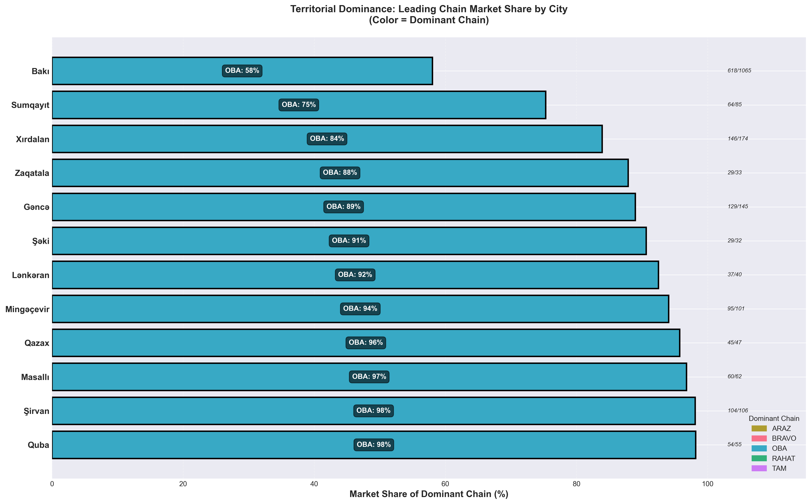

**Market Share by City**:
- Bar color indicates which chain dominates each city
- **Percentage shows**: Dominant chain's market share in that city
- **Numbers show**: (Dominant chain stores / Total city stores)

**Findings**:
- **OBA dominates** most cities with 50-90% market shares
- **ARAZ** leads in select urban markets
- **Zero cities** with 100% monopoly among top 15 - all show some competition
- **Competitive cities** (Baku, Sumqayıt): More balanced distribution (50-60% leader share)

---

## 7. Store Format Strategy

### Bravo Format Mix

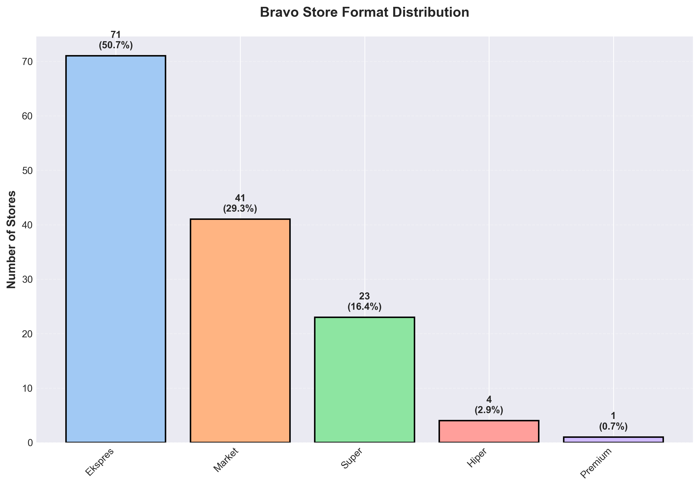

**Format Distribution** (Bravo - 140 stores):
- **Ekspres**: 71 stores (50.7%) - Convenience/urban quick-stop format
- **Supermarket**: 45 stores (32.1%) - Standard grocery format
- **Market**: 15 stores (10.7%) - Local neighborhood format
- **Plus**: 6 stores (4.3%) - Enhanced service format
- **Premium**: 3 stores (2.1%) - Upscale/gourmet format

**Multi-Format Strategy Benefits**:
1. **Market Segmentation**: Different formats serve different customer needs and locations
2. **Real Estate Flexibility**: Can enter markets with varying space availability
3. **Price Positioning**: Multiple brands allow different price points without cannibalizing core brand
4. **Competitive Response**: Can match competitors' formats without full repositioning

**Application to Other Chains**: Only Bravo publicly differentiates formats. This represents a competitive advantage and potential model for other chains.

---

## 8. Growth Potential Matrix

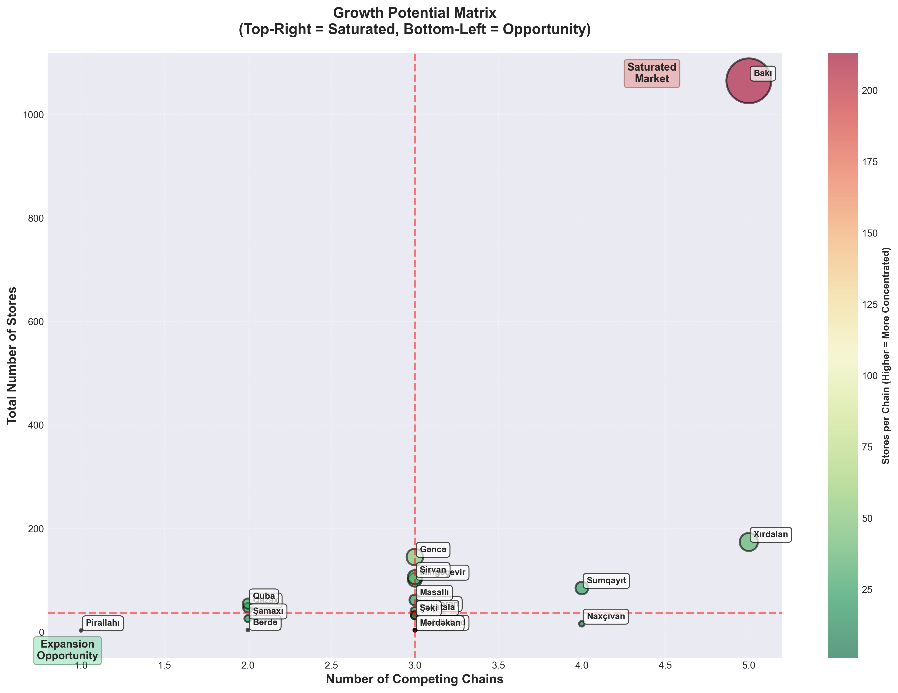

**Matrix Quadrants**:
- **Top-Right** (Saturated Market): Many chains + Many stores = Intense competition
- **Top-Left** (OPPORTUNITY): Few chains + Many stores = Undercompeted large markets
- **Bottom-Right**: Many chains + Few stores = Oversaturated small markets
- **Bottom-Left** (Expansion Opportunity): Few chains + Growing markets

**Identified Opportunities**:
1. **Quba** (55 stores, 2 chains): Large market, limited competition
2. **Lənkəran** (49 stores, 2 chains): Southern market with growth potential
3. **Masallı** (42 stores, 2 chains): Regional opportunity

**Avoid**: Bottom-right quadrant cities with high chain count but low total stores - these are oversaturated with limited growth potential.

**Strategic Guidance**:
- **For large chains (OBA, ARAZ)**: Focus on top-left opportunities - can support multiple locations
- **For mid-size chains (BRAVO, TAM)**: Target bottom-left quadrant - emerging markets before competitors
- **For small chains (RAHAT)**: Niche positioning in underserved segments of larger markets

---

## Strategic Recommendations

### 1. Market Entry Strategy

**For New Entrants or Expanding Chains**:

**Tier 1 Targets** (Immediate Opportunity):
- **Quba**: 55 stores, only 2 chains - large undercompeted market
- **Yevlax**: Lowest saturation (0.2 stores per 10k) - untapped demand
- **Lənkəran**: Southern regional hub with growth potential

**Tier 2 Targets** (Medium-term):
- Regional cities with monopoly/duopoly situations
- Cities showing population growth but static store counts
- Markets adjacent to existing successful locations (cluster strategy)

**Avoid**:
- Xırdalan (9.5 stores per 10k - oversaturated)
- Small cities with 5+ competing chains (profitability challenges)

### 2. Competitive Positioning

**Against OBA (Market Leader)**:
- **Don't compete on scale** - 71.8% market share is unassailable in near-term
- **Differentiation strategies**:
  - **Premium positioning** (Bravo model): Quality, service, experience over price
  - **Convenience focus**: Smaller formats, urban density, delivery
  - **Local/regional identity**: Community connection vs. national chain
  - **Specialty categories**: Organic, international, gourmet niches

**For Mid-Market Chains (ARAZ, BRAVO, TAM)**:
- **Defend core markets** aggressively - prevent OBA further penetration
- **Cluster strategy**: Dominate specific neighborhoods/cities rather than thin national spread
- **Format innovation**: Multiple formats (Bravo model) to capture different occasions
- **Customer data**: Loyalty programs to build switching costs

### 3. Geographic Expansion Priorities

**Phase 1: Immediate (Next 12 months)**
- Enter 2-3 underserved cities from opportunity matrix
- Test smaller formats in saturated Baku neighborhoods
- Strengthen presence in existing secondary markets

**Phase 2: Medium-term (1-3 years)**
- Build density in successful Phase 1 markets (cluster effect)
- Enter adjacent regions to existing strongholds (logistics efficiency)
- Consider acquisitions of smaller local players in target cities

**Phase 3: Long-term (3-5 years)**
- National footprint comparable to OBA in store count (but targeted cities)
- Establish regional distribution centers for expansion support
- Evaluate international expansion (Georgia, Turkey) if domestic mature

### 4. Format & Concept Innovation

**Recommended New Formats**:
1. **Express/Convenience**: <500 sqm, high-traffic urban locations, ready-meals focus
2. **Neighborhood Market**: 800-1200 sqm, residential areas, community feel
3. **Discount Hard Discounter**: Limited SKUs, private label, price-sensitive customers
4. **Premium Gourmet**: Import products, wine selection, prepared foods, affluent demographics
5. **Online/Dark Store**: Delivery-only format for e-commerce fulfillment

**Format by Market Type**:
- **Baku dense urban**: Express format (compete on convenience vs. OBA's size)
- **Suburban Baku**: Standard supermarket (1500-2500 sqm)
- **Regional cities**: Supermarket or discount (price-sensitive markets)
- **Small towns**: Smaller footprint neighborhood markets

### 5. Technology & Operations

**Investment Priorities**:
1. **E-commerce platform**: Delivery and click-collect for Baku market
2. **Loyalty/CRM system**: Customer data for personalization and retention
3. **Supply chain optimization**: Reduce costs to compete with OBA's scale advantages
4. **Private label development**: Higher margins, differentiation from competitors
5. **Store analytics**: Foot traffic, conversion optimization, labor scheduling

---

## Market Dynamics & Future Outlook

### Threats

1. **OBA Market Power**: 72% market share allows pricing pressure on suppliers and competitors
2. **Economic Sensitivity**: Supermarkets are discretionary spending - vulnerable to economic downturns
3. **E-commerce Disruption**: International players (Amazon, local startups) could enter via online
4. **Regulatory Risk**: High market concentration may trigger anti-trust scrutiny
5. **Real Estate Costs**: Prime locations in Baku increasingly expensive

### Opportunities

1. **Underserved Regions**: 44 cities with monopoly markets open to competition
2. **Format Innovation**: Only Bravo has multi-format strategy - model exists for replication
3. **Premium Segment**: Growing middle class/affluent population seeks quality over price
4. **Consolidation**: Potential M&A targets among smaller regional players
5. **Verticalization**: Private label, local sourcing, farm partnerships for differentiation

### Market Forecast (Next 5 Years)

**Expected Trends**:
- **Store count growth**: 5-7% annually (slower than GDP as e-commerce grows)
- **Consolidation**: #4 and #5 players likely acquired or merged
- **Format evolution**: Shift from large stores to smaller convenient formats
- **E-commerce**: 10-15% of grocery sales moving online in Baku
- **Regional expansion**: Accelerated growth in secondary cities as Baku saturates

---

## Methodology & Data Sources

### Data Collection

Each chain required different technical approach:

| Chain | Method | Complexity | Stores |
|-------|--------|------------|--------|
| OBA | HTML parsing (BeautifulSoup) | Medium | 1,640 |
| ARAZ | Next.js streaming data extraction | High | 369 |
| BRAVO | Static HTML scraping | Low | 140 |
| TAM | REST API integration | Medium | 82 |
| RAHAT | Google Maps JavaScript parsing | High | 53 |

### Data Quality

- **Coordinate Coverage**: 100% (all 2,284 stores successfully geocoded)
- **Address Completeness**: 98% (OBA stores use coordinate inference where address unavailable)
- **Data Collection Date**: December 2024
- **Update Frequency**: Snapshot analysis - not real-time

### Analysis Tools

- **Python**: Pandas, NumPy for data processing
- **Visualization**: Matplotlib, Seaborn for chart generation
- **Geospatial**: Coordinate-based city inference for stores without addresses
- **Business Metrics**: HHI (Herfindahl-Hirschman Index), market share, saturation ratios

---

## Project Structure

```
supermarket_chains_analyse/
├── data/
│   ├── combined.csv       # Master dataset (2,284 stores)
│   ├── bravo.csv          # 140 stores
│   ├── araz.csv           # 369 stores
│   ├── rahat.csv          # 53 stores
│   ├── oba.csv            # 1,640 stores
│   └── tam.csv            # 82 stores
├── scripts/
│   ├── combine.py         # Data merger
│   ├── analyze.py         # Analysis engine (15 charts)
│   └── [individual scrapers for each chain]
├── charts/                # 15 generated visualizations
└── README.md             # This comprehensive report
```

---

## Usage

### Running the Analysis

```bash
# Combine all chain data
python3 scripts/combine.py

# Generate charts and insights
python3 scripts/analyze.py

# Results in charts/ directory (15 PNG files)
```

### Requirements

```bash
pip install pandas matplotlib seaborn numpy scipy requests beautifulsoup4
```

---

## Key Metrics Summary Table

| Metric | Value | Insight |
|--------|-------|---------|
| **Total Stores** | 2,284 | Comprehensive market coverage |
| **Market Leader** | OBA (71.8%) | Near-monopolistic control |
| **Cities Served** | 74 | Nationwide presence |
| **Baku Concentration** | 46.6% | Extreme urban clustering |
| **Monopoly Markets** | 44 cities | Expansion opportunities |
| **Competitive Markets** | 16 cities (3+ chains) | Limited true competition |
| **Best Opportunity** | Quba (55 stores, 2 chains) | High demand, low competition |
| **Most Saturated** | Xırdalan (9.5 per 10k) | Avoid new entries |
| **Underserved** | Yevlax (0.2 per 10k) | Significant gap in market |
| **Format Leaders** | Bravo (5 formats) | Multi-format pioneer |

---

## Business Applications

This analysis provides actionable intelligence for:

### Retail Executives
- **Expansion planning**: Identify high-potential cities and avoid oversaturated markets
- **Competitive strategy**: Understand positioning relative to OBA and peers
- **Format decisions**: Data-driven choices on store types and sizes by market

### Investors & Private Equity
- **M&A targets**: Identify consolidation opportunities among smaller players
- **Market assessment**: Evaluate growth potential and competitive moats
- **Valuation support**: Market share, geographic presence, saturation metrics

### Real Estate Developers
- **Site selection**: Identify underserved areas with retail demand
- **Tenant mix**: Optimize shopping center composition based on local competition
- **Market sizing**: Estimate supportable retail square footage by city

### Policymakers & Regulators
- **Competition monitoring**: Track market concentration and consumer choice
- **Regional development**: Identify areas lacking retail access
- **Economic planning**: Understand retail sector structure and employment

### Consultants & Analysts
- **Market entry studies**: Comprehensive competitive landscape for clients
- **Benchmarking**: Compare chain performance metrics
- **Trend analysis**: Track market evolution over time

---

## Limitations & Caveats

1. **Temporal Snapshot**: Data reflects December 2024 - stores may open/close after collection
2. **Public Data Only**: Limited to publicly available information from websites
3. **Store Classification**: Some chains don't publicly differentiate formats (except Bravo)
4. **Population Estimates**: City populations are approximate - affects saturation calculations
5. **Revenue Unknown**: Analysis based on store count, not sales volume or profitability
6. **Private Chains Excluded**: Local independent supermarkets not captured in dataset
7. **Online Not Included**: E-commerce-only players (if any) not represented

---

## Future Enhancements

### Potential Analysis Extensions

1. **Temporal Tracking**: Monitor quarterly store openings/closings for trend analysis
2. **Demographic Overlay**: Correlate store locations with income, age, household size data
3. **Accessibility Mapping**: Calculate population coverage radiuses (drive-time analysis)
4. **Price Positioning**: Mystery shopping to map price points across chains
5. **Customer Sentiment**: Review analysis from social media and Google ratings
6. **Basket Analysis**: Category mix and assortment differentiation by chain
7. **International Comparison**: Benchmark Azerbaijan metrics vs. other countries

### Data Collection Automation

- **Automated scrapers**: Schedule weekly runs to track changes
- **Alert system**: Notify when competitors open stores in key markets
- **Dashboard**: Real-time visualization of market dynamics
- **API Integration**: Direct feeds from chains that offer APIs

---

## Contact & Further Research

**This analysis was created as a demonstration of data-driven market intelligence for the Azerbaijan retail sector.**

For questions, collaboration, or access to underlying datasets:
- Open an issue on GitHub
- Commercial inquiries welcome for updated or expanded analysis

**Data Collection**: December 2024
**Analysis Framework**: Business intelligence, competitive strategy, market opportunity assessment
**Tools Used**: Python, Pandas, Matplotlib, Seaborn, BeautifulSoup

---

## Conclusion

The Azerbaijan supermarket market presents a **tale of two opportunities**:

1. **Baku**: Intense competition among 5 chains requires **differentiation and innovation** to succeed. Focus on convenience formats, premium positioning, or operational excellence.

2. **Regional Cities**: **44 monopoly markets** represent clear expansion targets. Secondary cities show healthy demand with limited competition - ideal for systematic regional rollout.

**The winning strategy** combines:
- Selective geographic expansion to underserved cities
- Format innovation to serve different occasions and price points
- Operational efficiency to compete against OBA's scale advantages
- Customer data and loyalty to build switching costs

While OBA's 72% dominance appears insurmountable, **history shows** that focused regional players, premium differentiators, and format innovators can thrive even in concentrated markets. The key is **choosing the right battlegrounds** and **competing on dimensions beyond price and scale**.

**The data shows the opportunity. Execution will determine the winners.**

---

**© 2024 Azerbaijan Supermarket Market Analysis**
*Data-Driven Intelligence for Strategic Decision Making*
