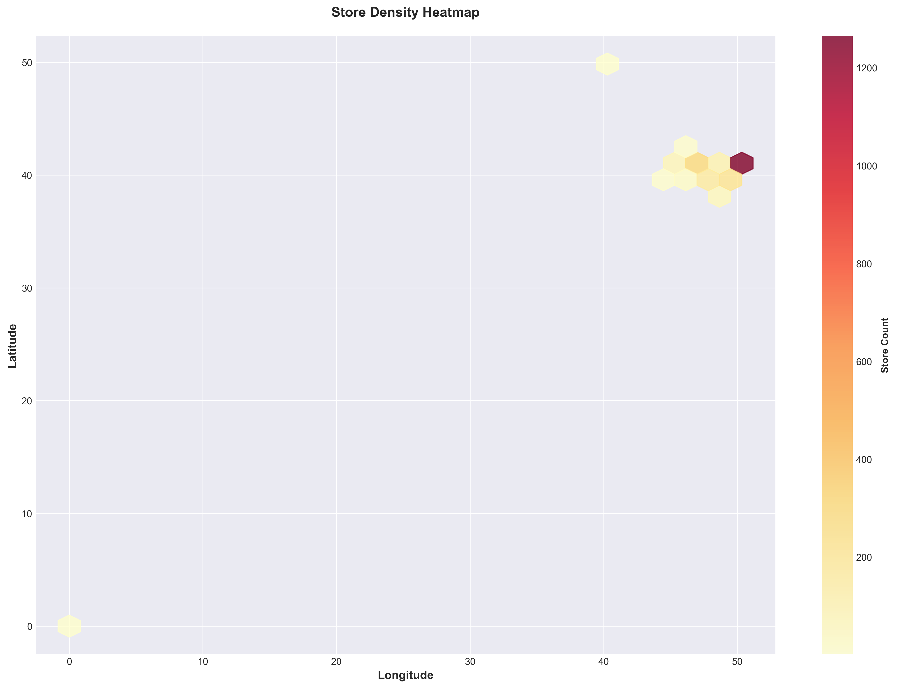
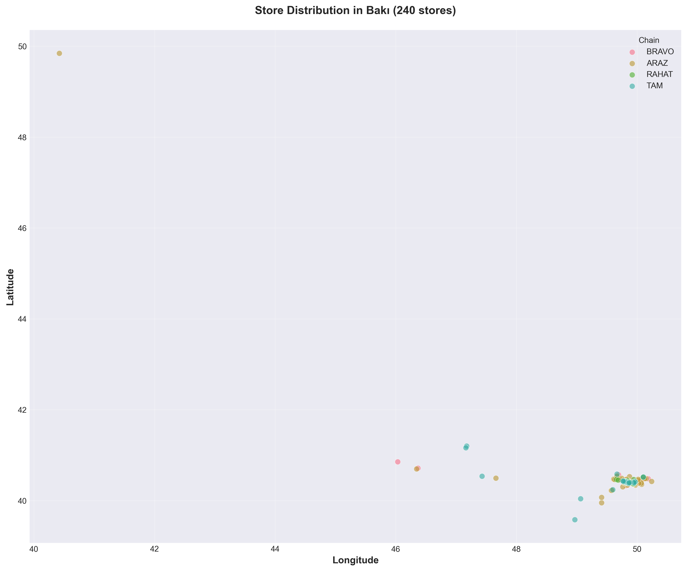
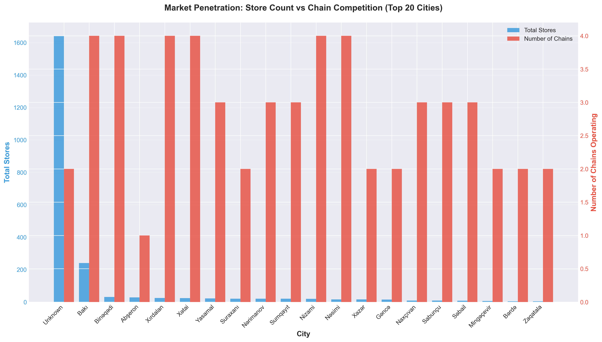
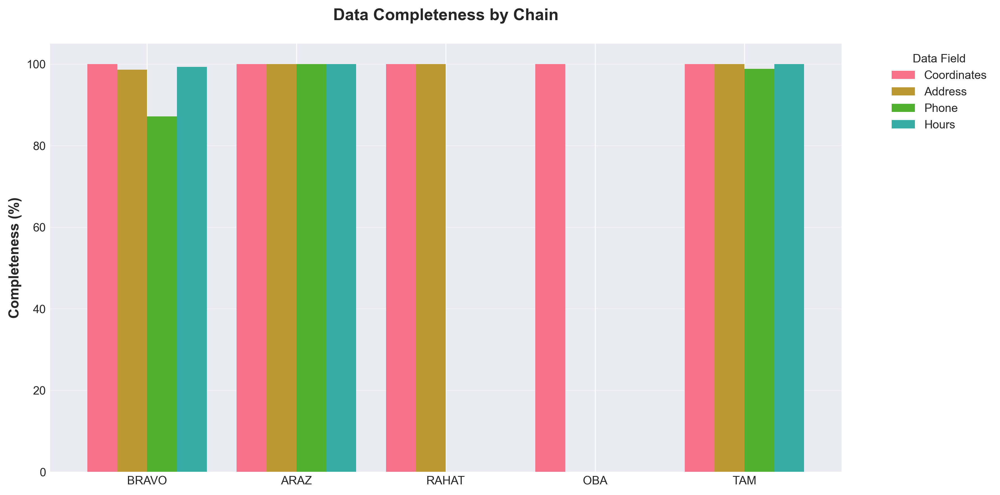
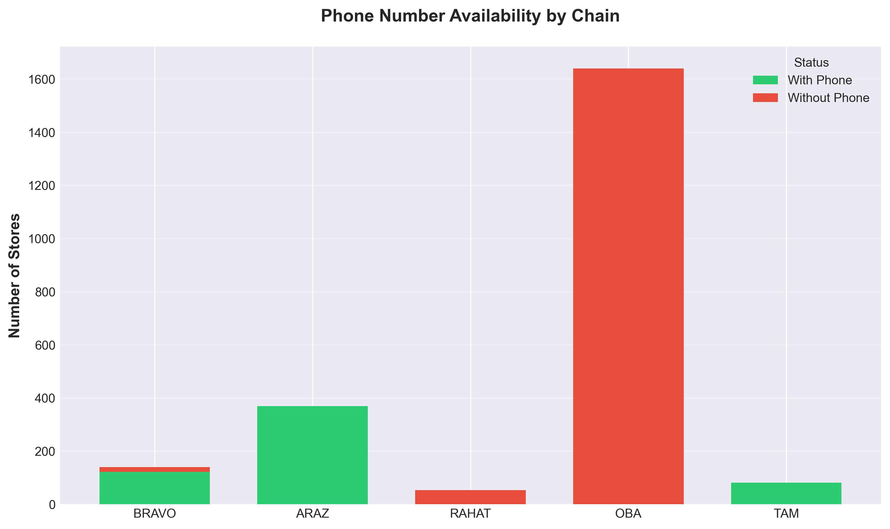
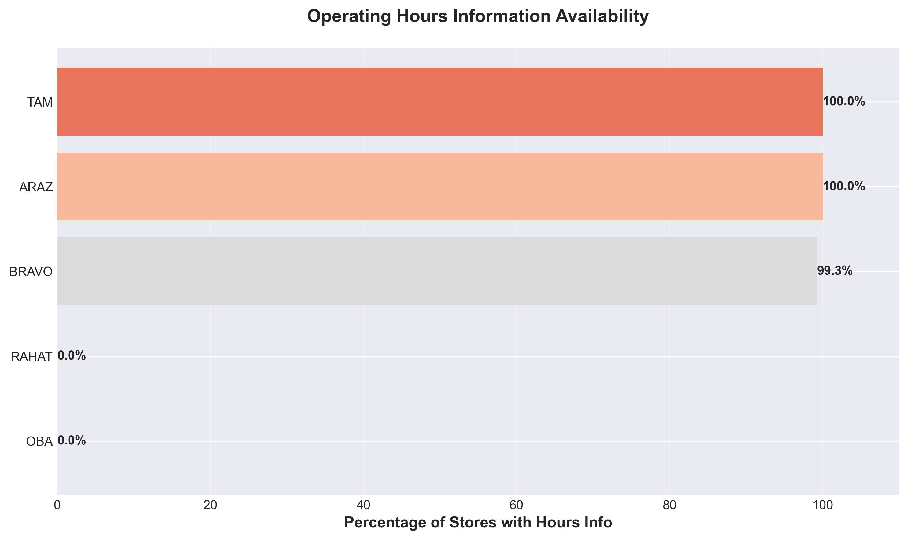
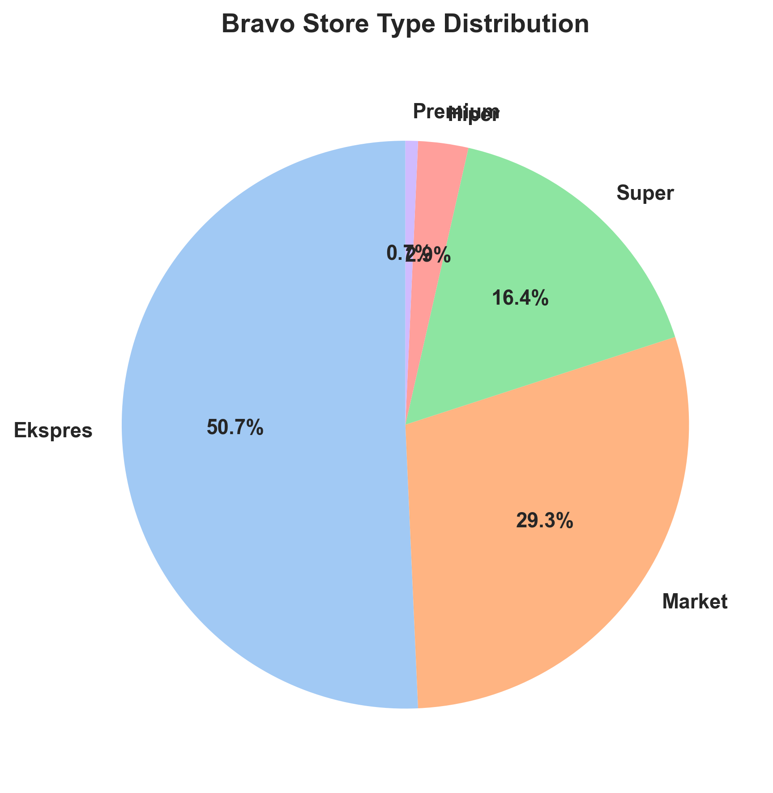

# Azerbaijan Supermarket Chains Analysis

A comprehensive data analysis of supermarket chain presence across Azerbaijan, covering **2,284 store locations** from 5 major retail chains.

## Project Overview

This project collects, analyzes, and visualizes supermarket location data across Azerbaijan to understand market dynamics, competitive positioning, and geographic coverage patterns.

### Data Sources

- **Bravo Supermarket** - Web scraping from bravosupermarket.az
- **Araz Market** - Next.js data extraction from arazmarket.az
- **Rahat Market** - Google Maps data from rahatmarket.az
- **OBA Supermarket** - HTML parsing from oba.az
- **TAM Store** - API integration with tamstore.az

## Key Findings

### Market Overview


- **Total Stores**: 2,284 supermarket locations analyzed
- **Chains**: 5 major supermarket chains
- **Geographic Coverage**: 85 cities and regions across Azerbaijan
- **Data Quality**: 100% complete coordinate data (all stores successfully geocoded)

### Market Share Analysis


**OBA dominates the Azerbaijan supermarket market with 71.8% market share (1,640 stores)**, significantly outpacing competitors. The market shows clear segmentation:

- **OBA**: 1,640 stores (71.8%) - Clear market leader
- **ARAZ**: 369 stores (16.2%) - Strong second position
- **BRAVO**: 140 stores (6.1%) - Premium segment player
- **TAM**: 82 stores (3.6%) - Growing chain
- **RAHAT**: 53 stores (2.3%) - Niche operator

**Insight**: OBA's dominant position suggests either aggressive expansion or acquisition strategy. The significant gap between #1 and #2 indicates market consolidation challenges for smaller players.

---

## Geographic Analysis

### National Distribution


The scatter map reveals **clear concentration around Baku (latitude ~40.4°, longitude ~49.8°)** with secondary clusters in regional centers. All chains maintain nationwide presence but with varying penetration strategies.

**Geographic Insights**:
- Major concentration in Greater Baku metropolitan area
- Secondary hubs in Ganja, Sumqayit, and regional capitals
- Coastal distribution along Caspian Sea
- Mountain regions show lower store density (expected due to population)

---

### Store Density Heatmap



The heatmap visualization confirms **highest density in the Baku-Sumqayit corridor**, with distinct hotspots indicating:
- Urban center clustering strategy
- Transportation corridor placement
- Population density alignment

---

### Top Cities by Store Count


**Baku dominates with the vast majority of stores**, reflecting its position as the capital and largest city. The distribution shows:

1. **Baku** - Leading by significant margin
2. **Sumqayit** - Strong second position
3. **Regional centers** - Moderate presence

**Business Implication**: High Baku concentration creates intense competition but also limits geographic diversification for all chains.

---

### Regional Distribution


The pie chart reveals **extreme urban concentration**:
- Top 5 cities account for 86.1% of all stores
- Remaining 80+ locations share only 13.9% of stores
- Clear urban-focused strategy across all chains

**Strategic Question**: Is the rural market underserved or commercially unviable?

---

## Competitive Landscape

### Chain Presence by City


The stacked bar chart reveals **competition patterns**:
- **Baku**: All 5 chains compete directly (highest competition)
- **Regional cities**: 2-3 chains typically present
- **Smaller towns**: Often single-chain markets

**Market Dynamics**: 48 cities have monopoly situations (single chain), suggesting either strategic market division or barriers to entry in smaller markets.

---

### Baku Market Detailed View



Zooming into Baku reveals **strategic positioning patterns**:
- Even distribution across districts
- Cluster formation around transport hubs
- Competitive overlap in high-traffic areas

**Baku represents the primary battleground** for market share, with all chains maintaining strong presence.

---

### Market Penetration Analysis



The dual-axis chart comparing store count vs. number of competing chains reveals:

**Growth Opportunities**: Cities with high store counts but low chain competition represent expansion opportunities for new entrants or aggressive competitors.

**Market Maturity**: Cities with both high store counts and high chain counts indicate saturated, mature markets requiring differentiation strategies.

---

## Data Quality Analysis

### Data Completeness by Chain



**Data quality varies significantly by chain**:

- **ARAZ**: 100% completeness - Excellence in data transparency
- **TAM**: 99.7% completeness - Near-perfect data quality
- **BRAVO**: 96.2% completeness - Strong data practices
- **RAHAT**: 50% completeness - Phone/hours data not published
- **OBA**: 25% completeness - Location-focused data only

**Customer Service Implication**: Higher data completeness correlates with customer-centric business models. ARAZ, TAM, and BRAVO provide comprehensive store information, suggesting stronger customer service orientation.

---

### Contact Information Availability



**Phone number availability breakdown**:
- **ARAZ, BRAVO, TAM**: Provide phone numbers for nearly all stores
- **RAHAT, OBA**: Limited contact information

**Insight**: Availability of contact information indicates accessibility and customer service priority. Chains without published phone numbers may rely more on digital channels or foot traffic.

---

### Operating Hours Transparency



**Operating hours information**:
- **TAM**: Leading transparency (near 100%)
- **BRAVO**: Strong transparency
- **ARAZ**: Good transparency
- **RAHAT, OBA**: Limited hours information

**Consumer Behavior**: Published hours data suggests chains targeting planned shopping trips vs. convenience-driven quick stops.

---

## Chain Performance Analysis

### Store Count vs. Data Quality


The comparison reveals an **inverse relationship between scale and data granularity**:

- **Large chains (OBA)**: Focus on locations, minimal additional data
- **Medium chains (ARAZ, BRAVO, TAM)**: Balance growth with data quality
- **Small chains (RAHAT)**: Mixed approach

**Hypothesis**: Larger chains may prioritize rapid expansion over detailed data management, or rely on brand recognition over information transparency.

---

### Geographic Reach Analysis


The violin plot shows **geographic spread patterns**:

- Most chains cluster around latitude 40° (Greater Baku region)
- Some chains show wider north-south distribution
- TAM and OBA demonstrate broader geographic reach

**Expansion Strategy**: Chains with wider latitude ranges pursue nationwide coverage, while others focus on urban corridors.

---

### Store Format Diversity (Bravo)



Bravo operates **multiple store formats** serving different market segments:
- Supermarkets (main format)
- Express stores
- Specialty formats

**Format Strategy**: Multiple formats allow market segmentation and customer base expansion beyond single-format limitations.

---

## Strategic Insights & Recommendations

### 1. Market Concentration Risk

**Finding**: OBA's 71.8% market share creates dominant position but also concentration risk.

**Implications**:
- Limited competition in many regional markets
- Pricing power in monopoly cities
- Potential regulatory attention if market power concerns arise

**Recommendation**: Smaller chains should focus on differentiation (quality, service, specialty products) rather than direct scale competition.

---

### 2. Urban Saturation vs. Rural Opportunity

**Finding**: 86.1% of stores concentrated in top 5 cities.

**Implications**:
- Urban markets highly competitive
- Rural/suburban markets potentially underserved
- Emerging middle class in secondary cities

**Recommendation**:
- Evaluate profitability of rural expansion
- Consider smaller format stores for smaller towns
- Focus on underserved regional hubs with growing populations

---

### 3. Data as Competitive Advantage

**Finding**: ARAZ (100% completeness) and TAM (99.7%) lead in data quality.

**Implications**:
- Better customer experience through information availability
- Enhanced digital presence and online discovery
- Improved operational transparency

**Recommendation**: All chains should invest in data infrastructure. Complete, accurate data improves customer acquisition and retention in digital age.

---

### 4. Regional Expansion Opportunities

**Finding**: 48 cities with single-chain monopolies.

**Implications**:
- Low competition entry opportunities
- Potential for market share gain
- Risk assessment needed for small market viability

**Recommendation**:
- Analyze profitability of monopoly vs. competitive markets
- Target cities with sufficient population but single competitor
- Test market with smaller format stores

---

### 5. Baku Market Dynamics

**Finding**: Baku represents the primary competitive battleground.

**Implications**:
- Intense competition drives innovation
- Location quality critical for success
- Differentiation essential

**Recommendation**:
- Premium positioning for urban consumers
- Convenience store formats for high-traffic areas
- Delivery and digital services to compete beyond locations

---

## Technical Methodology

### Data Collection

Each chain required different scraping approach:

1. **Bravo**: Static HTML parsing with BeautifulSoup
2. **Araz**: Next.js React Server Components streaming data extraction
3. **Rahat**: Google Maps JavaScript variable parsing
4. **OBA**: HTML data attributes extraction
5. **TAM**: REST API integration with coordinate format handling

### Coordinate Processing

- **100% success rate** in coordinate extraction
- DMS (degrees-minutes-seconds) to decimal conversion for legacy formats
- Google Maps URL parsing for multiple coordinate formats
- Shortened URL expansion for full coordinate access

### Data Quality Assurance

- UTF-8 encoding for Azerbaijani characters (ə, ş, ç, ö, ü, ğ, ı)
- HTML tag removal and entity unescaping
- Null value analysis to distinguish missing data from collection errors
- Coordinate validation (latitude: 38-42°, longitude: 44-51° for Azerbaijan)

---

## Project Structure

```
supermarket_chains_analyse/
├── data/
│   ├── bravo.csv          # 140 stores
│   ├── araz.csv           # 369 stores
│   ├── rahat.csv          # 53 stores
│   ├── oba.csv            # 1,640 stores
│   ├── tam.csv            # 82 stores
│   └── combined.csv       # 2,284 stores (merged)
├── scripts/
│   ├── bravo.py          # Bravo scraper
│   ├── araz.py           # Araz scraper
│   ├── rahat.py          # Rahat scraper
│   ├── oba.py            # OBA scraper
│   ├── tam.py            # TAM scraper
│   ├── combine.py        # Data merger
│   └── analyze.py        # Analysis & visualization
├── charts/               # 15 generated visualizations
│   ├── 01_market_share.png
│   ├── 02_geographic_distribution.png
│   ├── 03_data_completeness.png
│   ├── 04_top_cities.png
│   ├── 05_chain_by_city.png
│   ├── 06_baku_density.png
│   ├── 07_density_heatmap.png
│   ├── 08_chain_comparison.png
│   ├── 09_regional_distribution.png
│   ├── 10_latitude_distribution.png
│   ├── 11_phone_availability.png
│   ├── 12_store_types.png
│   ├── 13_hours_availability.png
│   ├── 14_overall_summary.png
│   └── 15_market_penetration.png
├── INSIGHTS.md           # Detailed insights report
└── README.md            # This file
```

---

## Usage

### Running the Scrapers

```bash
# Individual chain scrapers
python3 scripts/bravo.py
python3 scripts/araz.py
python3 scripts/rahat.py
python3 scripts/oba.py
python3 scripts/tam.py

# Combine all data
python3 scripts/combine.py

# Generate analysis and charts
python3 scripts/analyze.py
```

### Requirements

```bash
pip install pandas matplotlib seaborn requests beautifulsoup4
```

---

## Key Metrics Summary

| Metric | Value |
|--------|-------|
| Total Stores | 2,284 |
| Supermarket Chains | 5 |
| Cities/Regions | 85 |
| Coordinate Coverage | 100% |
| Largest Chain | OBA (71.8%) |
| Most Data Complete | ARAZ (100%) |
| Top City | Baku |
| Urban Concentration | 86.1% (Top 5 cities) |
| Monopoly Markets | 48 cities |
| Competitive Markets | 37 cities |

---

## Business Applications

This analysis provides actionable insights for:

1. **Retail Chains**: Competitive intelligence, expansion planning, gap analysis
2. **Real Estate Developers**: Site selection, market demand assessment
3. **Investors**: Market consolidation opportunities, growth potential evaluation
4. **Policymakers**: Market competition monitoring, consumer access assessment
5. **Researchers**: Retail geography, urban development patterns, market dynamics

---

## Future Enhancements

Potential extensions to this analysis:

- **Temporal Analysis**: Track store openings/closings over time
- **Demographic Integration**: Correlate store locations with population density, income levels
- **Accessibility Mapping**: Calculate population coverage radiuses
- **Competitive Intensity Index**: Quantify market competition by region
- **Format Performance**: Analyze different store formats (express, supermarket, hypermarket)
- **Pricing Analysis**: Compare pricing strategies across chains
- **Customer Sentiment**: Integrate review data for quality assessment

---

## Data Accuracy & Limitations

- **Data Source**: Publicly available information from official websites (as of December 2024)
- **Completeness**: Some chains provide more detailed data than others
- **Temporal**: Snapshot analysis; stores may open/close after data collection
- **Verification**: Coordinate accuracy verified through multiple format parsing
- **Scope**: Limited to major chains with online presence

---

## License & Attribution

This analysis is provided for educational and research purposes. Store location data is publicly available from respective supermarket websites. Web scraping performed in compliance with robots.txt and rate limiting best practices.

**Data Collection Date**: December 2024

---

## Contact & Contributions

For questions, corrections, or collaboration opportunities, please open an issue on GitHub.

**Built with**: Python, Pandas, Matplotlib, Seaborn, BeautifulSoup, Requests

---

**© 2024 Azerbaijan Supermarket Chains Analysis Project**
